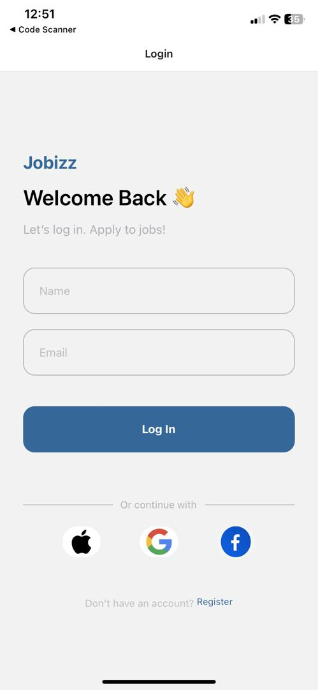
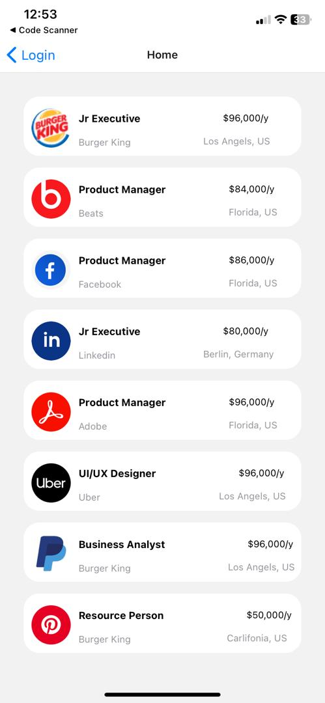
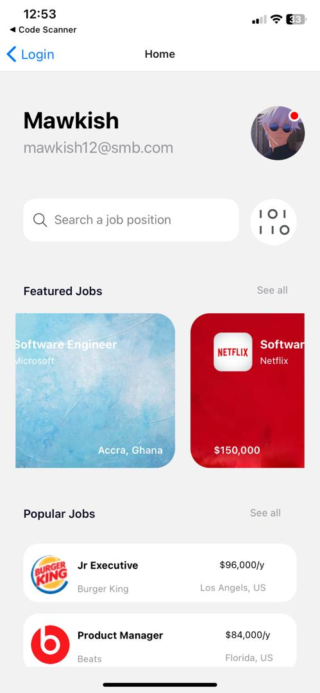
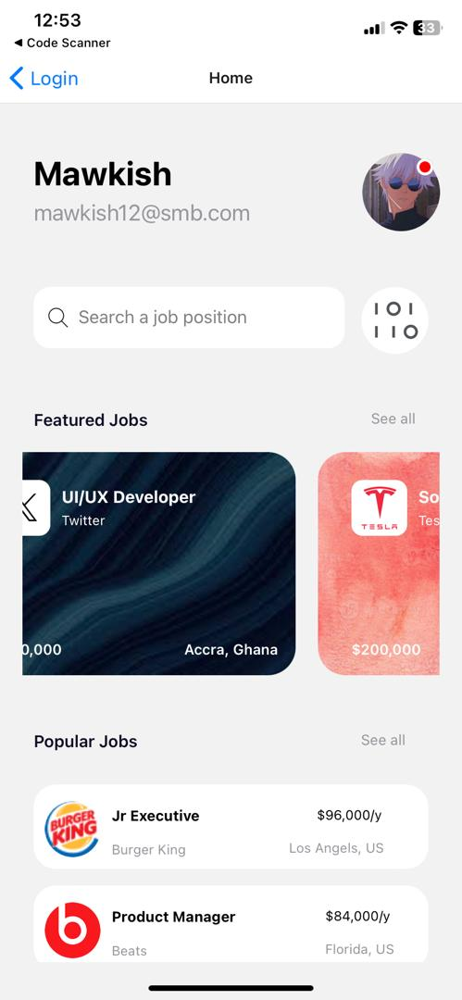
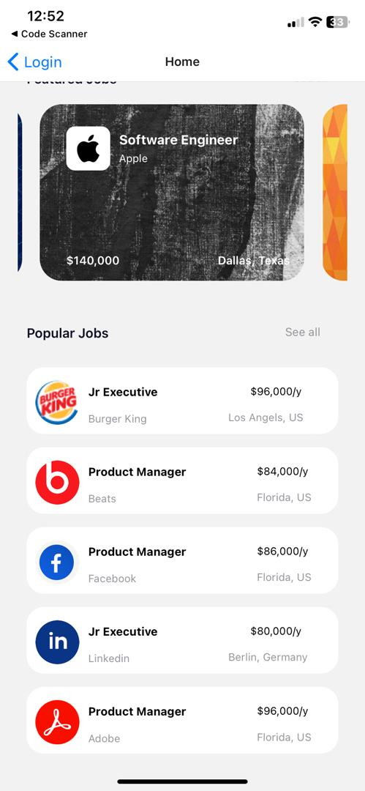
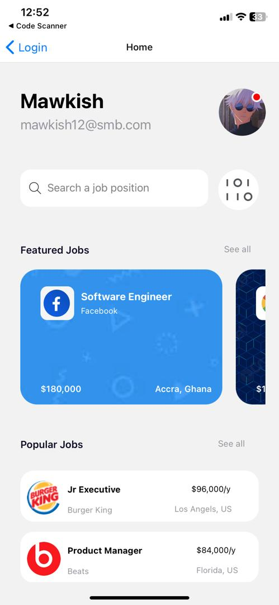

# rn-assignment4-11300128
## Assignment IV - 11300128
### About my Components used 
There are three components present in my project 
They are:
- App Component
- Login Component
- Homepage Component
#### The App Component
The App component contains all the other component in it. It consist of all the necessary navigation , stacks and import statement.
#### The Login Component
This component is the first component to return a visual representation. that is, it is the first page to be seen when the app is opened. it contains spaces for users to enter their usernames and emails and possibly register first before proceeding
#### HomePage Component
this component shows the details of the user and the popular and featured job cards of the. it also showcases the users profile picture with spot indicating the user activeness, email and username.

### Below Are Some Screenshots of the App

 
 
 
 
 
